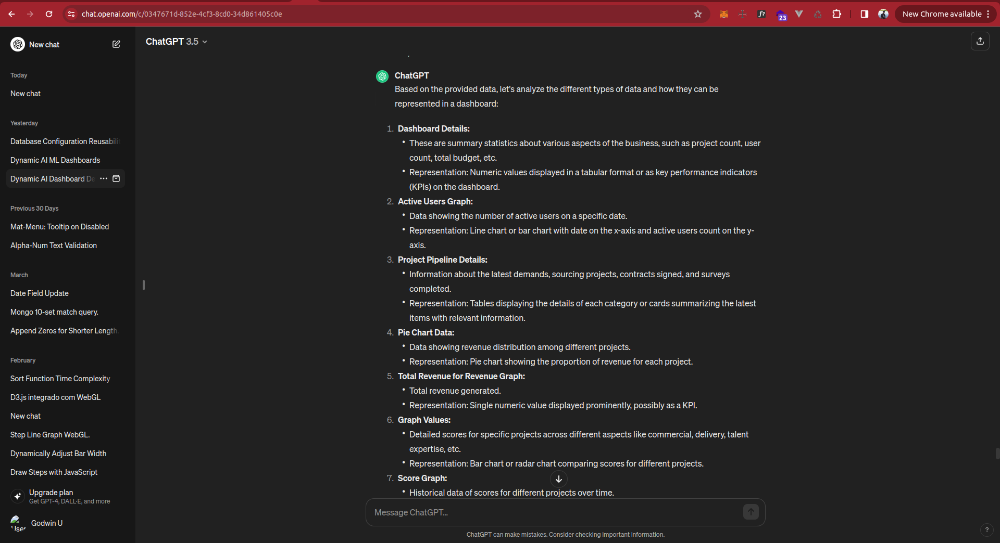
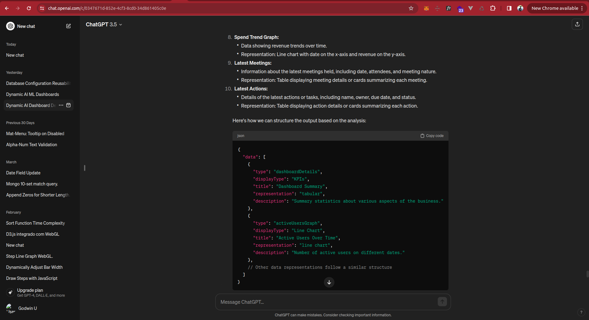
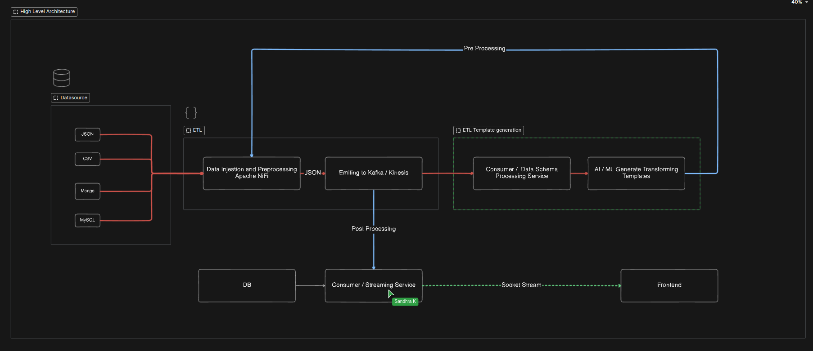

# DynamicDashboard

# Github model references:
https://github.com/xai-org/grok-1
https://github.com/meta-llama/llama
https://github.com/nomic-ai/gpt4all

# Reference links:
https://qdrant.tech/benchmarks/?utm_source=google&utm_medium=cpc&utm_campaign=21019945866&utm_content=158828616653&utm_term=vector%20db&gad_source=1&gclid=CjwKCAjwwr6wBhBcEiwAfMEQszuae78u6NYZMvLs7qu7SH1YfebSZ5URySXsTq2DSj-bDBZczsoR5hoCmZsQAvD_BwE
https://unstructured.io/
https://www.tableau.com/

# Figma
https://www.figma.com/file/wHtFGYRNgwkyGlffsCvS0m/D2D-CRM?type=design&node-id=2%3A46&mode=dev&t=9ZmbbEfOVqZEEMsQ-1

# Sample data tested with ChatGpt

# Proposed Architecture Diagram
